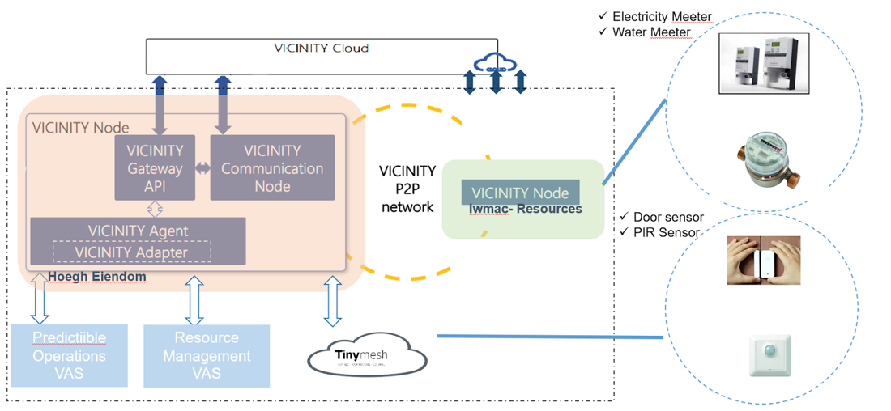

# Architecture
The architecture of VICINITY Node is seen in the following figure. All adapter will connect to the agent. 
In this way, VICINITY Nodes will be communicated with agent, but will continue to operate separately.



# Installation
Required software: 
* Install JDK 1.8 on your machine
* install Postgresql 9.6.8
* install maven

Download the source code from the repository:
```sh
git clone git@github.com:vicinityh2020/vicinity-adapter-tinymesh.git
```

You need to set following environment variables to run the adapter.
To let Maven work everywhere you need to export following environmental variables:

* `M2_HOME=/usr/local/apache-maven/apache-maven-3.5.3`
* `M2=$M2_HOME/bin`
* `MAVEN_OPTS=-Xms256m -Xmx512m`

Now append the M2 variable to the system path:
* `PATH=$M2:$PATH`

Finally, verify if Maven has been added by running:
```sh
$ mvn -version
```

The output should be as follows:

```sh
Apache Maven 3.5.3 (7994120775791599e205a5524ec3e0dfe41d4a06; 2016-12-03T17:27:37+05:30)
Maven home: /usr/local/apache-maven/apache-maven-3.3.9
 
Java version: 1.8.0_75, vendor: Oracle Corporation
 
Java home: /usr/local/java-current/jdk1.8.0_75/jre
```

Now you need to set Tinymesh cloud variables for connection on your environment. 

* `TINYM_NETWORK_ID=<network id provided by Tiny Mesh>`
* `TINYM_CLOUD_EMAIL=<YOUR_TINYM_E-MAILprovided by Tiny Mesh>`
* `TINYM_CLOUD_PASS=<YOUR_TINYM_PASSWORD provided by Tiny Mesh>`

You need to set variables for your database. This variables should match the variables you use on your adapter for connection.

Following are the variables you should use on your machine.

* `PATH=/home/opt/PostgreSQL/9.5/bin:$PATH`
* `PGDATA=/home/opt/PostgreSQL/9.5/data`
* `PGDATABASE=YOUR_DB_NAME`
* `PGUSER=USER_NAME`
* `PGPASSWORD=USER_PASSWORD`
* `PGPORT=YOUR_PORT`
* `PGLOCALEDIR=/home/opt/PostgreSQL/9.5/share/locale`
* `MANPATH=$MANPATH:/home/opt/PostgreSQL/9.5/share/man`


# Endpoints

We have implemented endpoints in our adapter to read information about devices. These endpoints are:

* GET /objects
    - Returns all devices registered at the adapter and thing description of devices
* GET /objects/{oid}/properties/{pid}
    -Returns last known value and time the value was received by the device. “oid” is UUID of device and “pid” is a 
    property identifier.